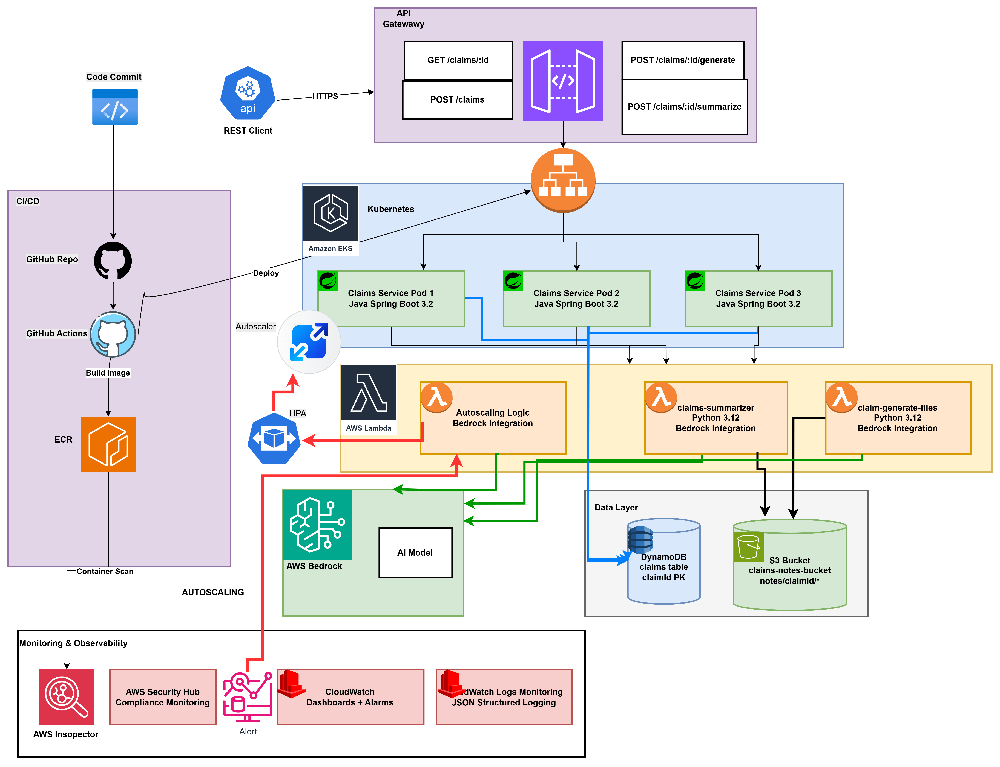

# GenAI-Enabled Claim Status API – Project Wiki

## Overview
This project implements a production-ready, AI-powered claim status API on AWS. It leverages Amazon EKS (Kubernetes), API Gateway, DynamoDB, S3, Lambda, and Amazon Bedrock for GenAI summarization. The architecture is designed for scalability, security, observability, and automated deployment, with a clean separation of concerns and modern cloud-native best practices.

## Project Architecture



## Project Structure
```
cna2-intr2-devops/
├── devOps/                # Infrastructure as Code (Terraform, scripts)
│   ├── *.tf               # Terraform modules (EKS, IAM, ECR, API Gateway, DynamoDB, S3, Lambda, etc.)
│   ├── lambdas.tf         # Lambda deployment and permissions
│   ├── cloudwatch_ci_logs.tf # CloudWatch log group (optional)
│   ├── ...                # Other infra modules
├── lambdas/               # AWS Lambda functions (AI, claim generation, deployment scripts)
│   ├── ai_autoscaler.py
│   ├── claims_summarizer.py
│   ├── claim_data_notes_generator.py
│   ├── deploy.sh
│   ├── requirements.txt
│   ├── README.md
│   └── ...
├── documentation/         # Architecture diagrams, project justification, improvement suggestions
│   ├── ArchitectureDiagramAIScaling.png
│   ├── architectureDiagram.png
│   ├── project_justification_images.md
│   ├── next_step_improvements.md
│   ├── AI-Autoscaler-How-It-Works.md
│   ├── AI-Autoscaling-Architecture.md
│   ├── JMETER_TEST_README.md
│   ├── Postman-API-collection.json
│   ├── DOCUMENTATION-chapters.md
│   └── ...
├── mock-claims/           # Sample claim data and notes
│   ├── claim_miller_2026.md
│   ├── claim_peterson_2026.md
│   ├── claim_rodriguez_2026.md
│   ├── claim_thorne_2026.md
│   └── claim_whitmore_2026.md
├── scans/                 # Security scan results and images
│   ├── AWS image scanner integrated.png
│   ├── CICD-security scan.png
│   └── ecr-scan-results.json
├── README.md              # Project Wiki and main documentation
├── LICENSE                # Project license
├── business context.txt   # Business context and requirements
├── eks commands.txt       # EKS management commands
└── ...                    # Other supporting files
```

### Key Components
- **API Gateway**: Exposes REST endpoints for claim status and summarization. Handles authentication, throttling, and routing to EKS.
- **EKS Service (Spring Boot)**: Main application logic. Handles requests, queries DynamoDB, fetches notes from S3, and invokes Lambda for AI summarization.
- **AWS Lambda (AI Summarizer)**: Serverless function that integrates with Amazon Bedrock to generate claim summaries using GenAI (Claude model). Isolates AI logic for cost and scalability.
- **Amazon Bedrock**: Provides GenAI summarization using Anthropic Claude models. Prompts are engineered for overall, customer, adjuster, and recommendation summaries.
- **DynamoDB**: Stores claim status and metadata.
- **S3**: Stores claim notes, adjuster documents, and customer correspondence.
- **CloudWatch**: Centralized logging, metrics, and (optionally) dashboards for observability.
- **ECR**: Container registry for application images, scanned by Amazon Inspector.
- **CI/CD Pipeline**: Automated build, test, security scan, and deployment using GitHub Actions.


## HPA (Horizontal Pod Autoscaling)
- **Kubernetes HPA** is configured for the claims API deployment on EKS.
- **Scaling Policy**: Pods scale based on CPU/memory usage, ensuring cost efficiency and responsiveness to traffic spikes.
- **Cluster Autoscaler**: EC2 nodes scale automatically to support pod scaling.
- **Terraform**: HPA and autoscaler policies are defined in infrastructure code.

## CloudWatch Observability
- **Centralized Logging**: All application, Lambda, and infrastructure logs are sent to AWS CloudWatch.
- **Metrics**: Key metrics (API latency, error rates, Bedrock usage, DynamoDB/S3 ops) are tracked and can be visualized in CloudWatch dashboards.
- **Dashboards**: Custom dashboards can be created for real-time monitoring of service health, scaling events, and AI usage/costs.
- **Alarms**: Set up CloudWatch alarms for error rates, latency, or resource exhaustion to enable proactive alerting.

### Example CloudWatch Metrics
- API Gateway: 4XX/5XX error count, latency
- EKS: Pod CPU/memory, HPA events
- Lambda: Invocations, errors, duration
- Bedrock: Model invocation count, cost

### How to Use
1. Access the AWS Console > CloudWatch.
2. Navigate to Log Groups for application and Lambda logs.
3. Use the Metrics and Dashboards sections to visualize and monitor key indicators.
4. Use `cloudwatch_ci_logs.tf` in `devOps` to provision log groups and dashboards as code.

## Stress Testing with JMeter
- **Purpose**: Validate autoscaling, performance, and stability under load.
- **Tool**: Apache JMeter (or similar load testing tool)

### How to Run JMeter Tests
1. Prepare a JMeter test plan (`.jmx` file) targeting the API Gateway endpoints (e.g., `/claims/{id}`, `/claims/{id}/summarize`).
2. Run locally or in CI:
   ```bash
   jmeter -n -t claim-api-stress-test.jmx -l results.jtl
   ```
3. Observe CloudWatch metrics and HPA scaling events during the test.
4. Analyze JMeter results for latency, error rates, and throughput.

### Example Scenarios
- Sustained load to trigger HPA pod scaling
- Burst traffic to test API Gateway throttling
- Large payloads to validate Lambda/Bedrock performance

## How to Use
### Prerequisites
- AWS account with permissions for EKS, Lambda, Bedrock, DynamoDB, S3, ECR, CloudWatch
- Terraform and kubectl installed
- Docker for local builds
- GitHub repository for CI/CD

### Deployment Steps
1. **Provision Infrastructure**
   - Run `terraform init` and `terraform apply` in the `devOps` folder to deploy all AWS resources.
2. **Build and Push Application Image**
   - Use the CI/CD pipeline or run `docker build` and push to ECR manually.
3. **Deploy to EKS**
   - CI/CD pipeline applies Kubernetes manifests, or use `kubectl apply -f k8s-deployment.yaml`.
4. **Configure API Gateway**
   - Terraform sets up REST endpoints and integration with EKS.
5. **Invoke Endpoints**
   - `GET /claims/{id}`: Returns claim status from DynamoDB.
   - `POST /claims/{id}/summarize`: Fetches notes from S3, invokes Lambda/Bedrock, returns AI-generated summaries.
6. **Monitor and Observe**
   - View logs and metrics in CloudWatch.
   - Review security scan results in the `scans/` folder and GitHub Actions artifacts.

## Component Explanations
- **Spring Boot Service**: Handles business logic, error handling, and integration with AWS services. Implements REST endpoints and orchestrates AI summarization via Lambda.
- **Lambda Function**: Python-based, stateless, and optimized for Bedrock API calls. Handles prompt engineering and response formatting.
- **Bedrock Model**: Anthropic Claude model used for summarization. Prompts are tailored for different summary types (overall, customer, adjuster, recommendation).
- **CI/CD Pipeline**: Automates build, test, scan, and deploy. Ensures code quality and security before production deployment.
- **Observability**: CloudWatch logs, metrics, and health checks (`/health/ready`, `/health/live`, `/metrics`).
- **Security**: Inspector scans container images; IAM policies enforce least privilege; Security Hub integration is recommended for future improvements.


## API Reference & Tools
- **Postman Collection**: A ready-to-use Postman collection for the API is available at [`documentation/introspect2B-collection.json`](./documentation/introspect2B-collection.json). Import this file into Postman to test and explore all endpoints interactively.


## More Information & Documentation

For detailed architecture diagrams, autoscaling explanations, load testing, and project justification, see the [`documentation/`](./documentation/) folder. Key documents include:

- [project_justification_images.md](./documentation/project_justification_images.md): Visual justification and architecture diagrams
- [next_step_improvements.md](./documentation/next_step_improvements.md): Architectural improvement suggestions and roadmap
- [AI-Autoscaler-How-It-Works.md](./documentation/AI-Autoscaler-How-It-Works.md): How the AI-powered autoscaler works
- [AI-Autoscaling-Architecture.md](./documentation/AI-Autoscaling-Architecture.md): Autoscaling architecture details
- [JMETER_TEST_README.md](./documentation/JMETER_TEST_README.md): JMeter load testing instructions and scenarios
- [introspect2B-collection.json](./documentation/introspect2B-collection.json): Postman collection for API testing

For implementation phases, data models, and risk assessment, see [IMPLEMENTATION_STRATEGY.md](./IMPLEMENTATION_STRATEGY.md).
For lab requirements and evaluation criteria, see [introspect 2B text.md](./introspect 2B text.md).

---
### Terraform Setup (for reference)

- **Region**: us-east-1
- **AWS Profile**: cna2
- **Cluster Name**: introspect2-eks
- **Kubernetes Version**: 1.29
- **Node Instance Type**: t3.medium
- **Capacity Type**: ON_DEMAND
- **Node Group Scaling**: Min 1, Max 3, Desired 2

#### Initialize AWS Resources
```bash
# On Linux/Mac
./aws_terraform_init.sh
```

```cmd
REM On Windows
aws_terraform_init.cmd
```


#### Usage
```bash
terraform init
terraform plan
terraform apply
aws eks update-kubeconfig --name introspect2-eks --region us-east-1 --profile cna2
```

#### Example Terraform Output
```
api_gateway_id = "9wponijp82"
api_gateway_invoke_url = "https://9wponijp82.execute-api.us-east-1.amazonaws.com/prod"
api_gateway_url = "https://9wponijp82.execute-api.us-east-1.amazonaws.com/prod/claims"
claim_generate_files_lambda_arn = "arn:aws:lambda:us-east-1:660633971866:function:claim_generate_files"
claim_generate_files_lambda_name = "claim_generate_files"
claims_summarizer_lambda_arn = "arn:aws:lambda:us-east-1:660633971866:function:claims-summarizer-lambda"
claims_summarizer_lambda_name = "claims-summarizer-lambda"
cluster_arn = "arn:aws:eks:us-east-1:660633971866:cluster/introspect2-eks"
cluster_certificate_authority_data = "LS0tLS1CRUdJTiBDRVJUSUZJQ0FURS0tLS0tCk1JSURCVENDQWUyZ0F3SUJBZ0lJVmlGWXBjaG1jVXd3RFFZSktvWklodmNOQVFFTEJRQXdGVEVUTUJFR0ExVUUKQXhNS2EzVmlaWEp1WlhSbGN6QWVGdzB5TmpBeU1ETXdOekUwTXpSYUZ3MHpOakF5TURFd056RTVNelJhTUJVeApFekFSQmdOVkJBTVRDbXQxWW1WeWJtVjBaWE13Z2dFaU1BMEdDU3FHU0liM0RRRUJBUVVBQTRJQkR3QXdnZ0VLCkFvSUJBUUMrc3FOOVJYZWEycjFqM0FXRldKODJpQytKQmN3TTNOdUlSQXJNbDNXRVpsTjhwaG5WUnVESkxYSG0KVWRtWFUyelRRbVNYSitTZnFQVUxLODRiYjlXV2d6WFVOSHJzek43cDZBdExmd3NPNUNHNXJPMmtLSWtoUE9VaAp3dytnc2hHQ2FrVjV6WGVZd1ZJRk9Id0JvTUxQR25vRGhkbkJielh3d0QzbVRMUVNFVUp6d2taZDZoMGw1WEFQCkZZeVUwMlJ2WW9wWXJHVnBmRk45VTRUdTJLWllwYUhNOGNIN3RQZmx4QUM4YmVwaERIaXZGTEpEVzEraFJ0T00Kc09DYmJyTWJNSU91QTMrOFVOVEVnbnV1NjRJYmk1SVhZM05YUk9yQ2dxVHBXZjAwNUdBeEUrdTI1UUw0WE9DUAppbzBNMjZxeitjTjFtaW9oVGFrWTRPb3Erc3FMQWdNQkFBR2pXVEJYTUE0R0ExVWREd0VCL3dRRUF3SUNwREFQCkJnTlZIUk1CQWY4RUJUQURBUUgvTUIwR0ExVWREZ1FXQkJTOVljYkZZMnM3Vy9xSGtERXd2MmVNbzV2TEd6QVYKQmdOVkhSRUVEakFNZ2dwcmRXSmxjbTVsZEdWek1BMEdDU3FHU0liM0RRRUJDd1VBQTRJQkFRQlNha3MxYzJ2eApyNkZJaU81a1l2dkFmYWlvRFVkTmhIVGtqaG1TZGpYWm54Wk01NFkvcldQMkpReUtaZUFtdlRrb21SM3crb1RYCnlOSTlvdTU0c29BQ0plS2NzNFV3cHJZYlJETERDalVJUHpmaVlGRE1PY1ZvNWRCTnlRUktvcm9tUnN3WXRiTGYKREpoOEdsb1Q4bkhKWXpOYTAvWFRsWkxiMUNDdlFGOVQ4S1VzWGZuUkhORG5JRndwQjhxSTByM2VBaUtJenk0dgpRTGtsTVhZdnZpNG4rN1Zqby8reGo4TFo5YmFlL0dmYk51d3l6clc5Q2Z5OTJHM3c4eVdLelRxUHQzY0dEelZyCksvdVB6T2hncU03aGh6YVFnMG1mNVE2aHliZEIxVU1tL01jVU1BUVVjclN4dWY2QlhYNC83M3FxbklQMG83NDgKdWJiUWNNaVAvZ2NECi0tLS0tRU5EIENFUlRJRklDQVRFLS0tLS0K"
cluster_endpoint = "https://C419DDEC3F34C7EC70675F86E02C3479.yl4.us-east-1.eks.amazonaws.com"
cluster_name = "introspect2-eks"
configure_kubectl = "aws eks update-kubeconfig --name introspect2-eks --region us-east-1 --profile cna2"
dynamodb_table_arn = "arn:aws:dynamodb:us-east-1:660633971866:table/claims"
dynamodb_table_name = "claims"
ecr_repository_arn = "arn:aws:ecr:us-east-1:660633971866:repository/introspect2-claims"
ecr_repository_url = "660633971866.dkr.ecr.us-east-1.amazonaws.com/introspect2-claims"
node_group_name = "main"
private_subnet_ids = [
   "subnet-0713084014ba90d06",
   "subnet-005bca7896953739d",
]
public_subnet_ids = [
   "subnet-0529ce4af419faae2",
   "subnet-0e9ab9f0e7b5ce5fe",
]
s3_bucket_arn = "arn:aws:s3:::claims-notes-bucket"
s3_bucket_name = "claims-notes-bucket"
vpc_id = "vpc-0246252edc02fee9b"
```

5. **Verify the cluster**:
    ```bash
    kubectl get nodes
    kubectl get pods -A
    ```

## Cleanup

To destroy the cluster and all resources:
```bash
terraform destroy
```

## Files

- `versions.tf` - Provider versions
- `variables.tf` - Input variables
- `main.tf` - Main infrastructure configuration
- `outputs.tf` - Terraform outputs
- `terraform.tfvars` - Variable values
- `aws_terraform_init.sh` - AWS resource initialization script (Linux/Mac)
- `aws_terraform_init.cmd` - AWS resource initialization script (Windows)
- `terraform-introspect2-policy.json` - IAM policy for Terraform operations
- `.gitignore` - Git ignore rules