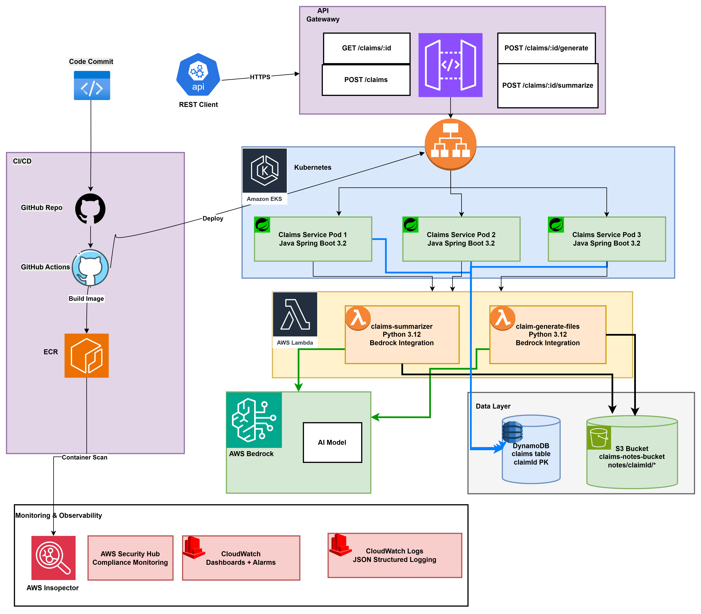
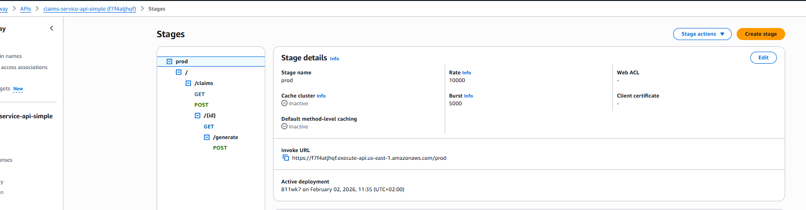
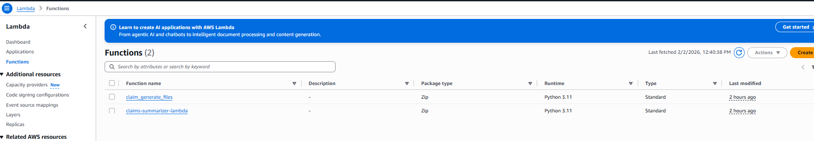
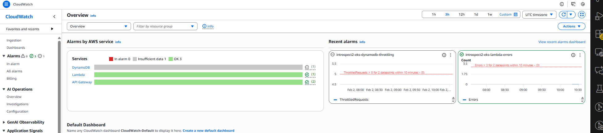
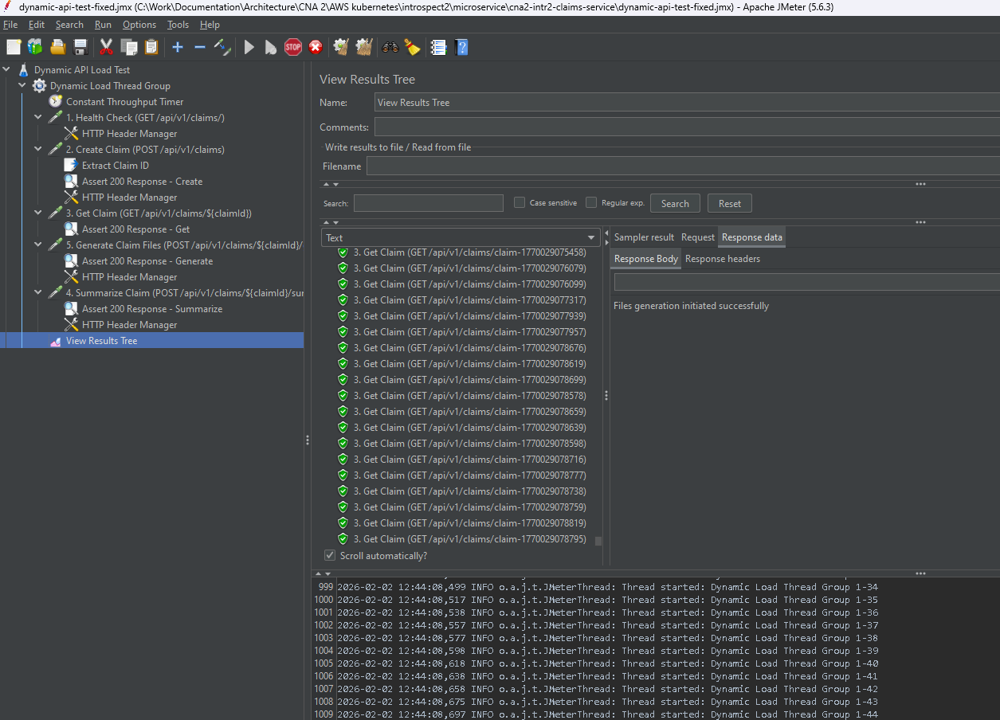
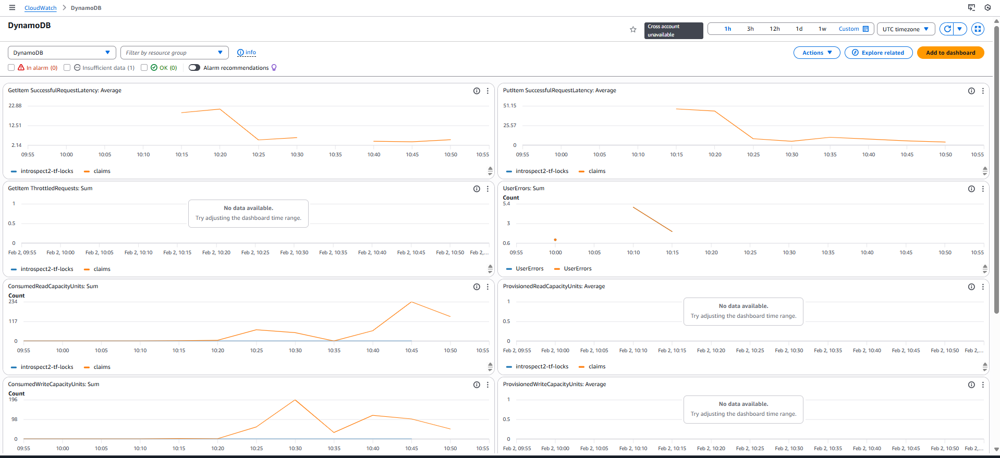
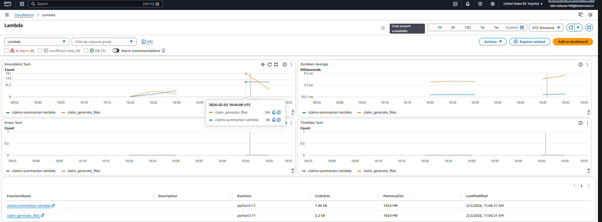

# Project Implementation: Architecture and Observability Images

This document provides visual justification and architectural context for the GenAI-enabled Claim Status API project. The following images illustrate key components, design decisions, and operational insights that support the project's architecture and implementation.

## Architecture and Design

### Overall Architecture
- 

### AI Scaling Architecture
- 

### API Gateway and Claims Contract
- 

### Autoscaling and Lambda
- 
- 
- 

## Observability and Performance

### CloudWatch and Load Testing
- 
- 
- 
- 

### Data Storage
- 
- 

## Notes
- For detailed explanations, see the corresponding markdown files and diagrams in this folder.
- These visuals support the architectural choices, scalability, and operational readiness of the project.
